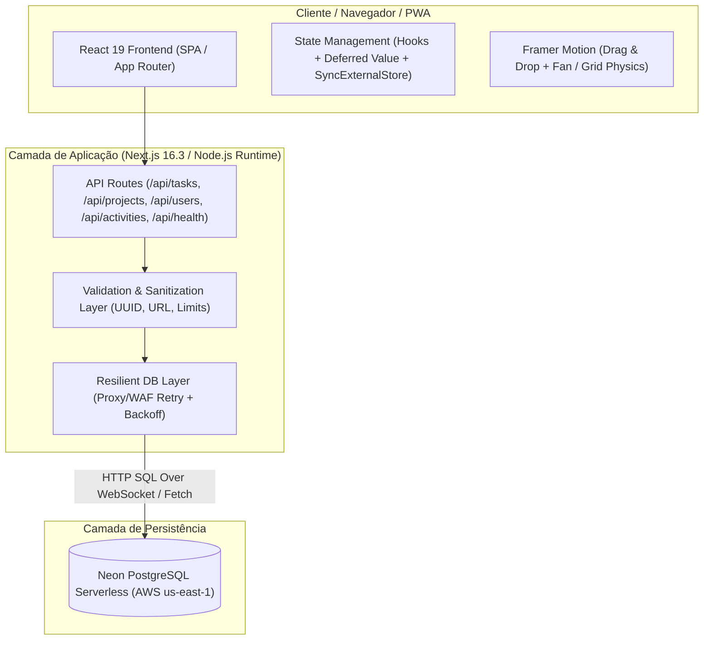
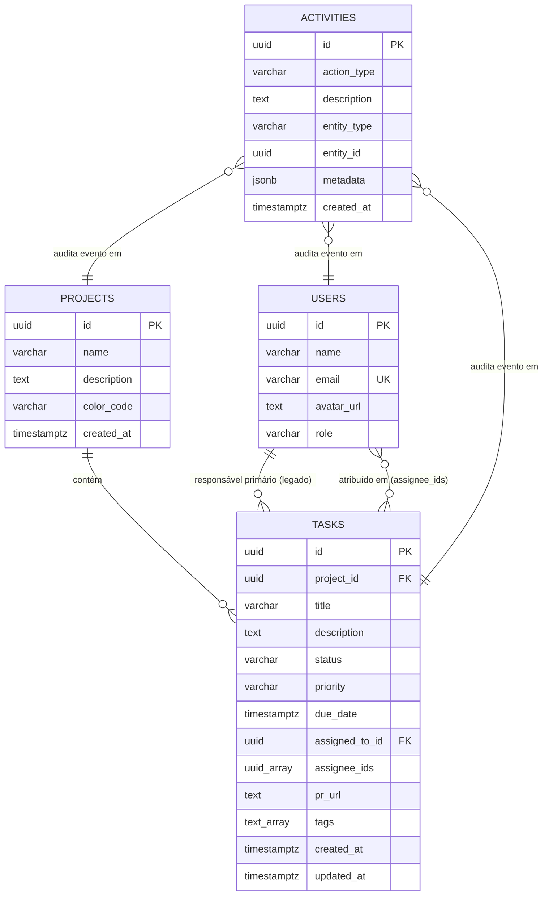
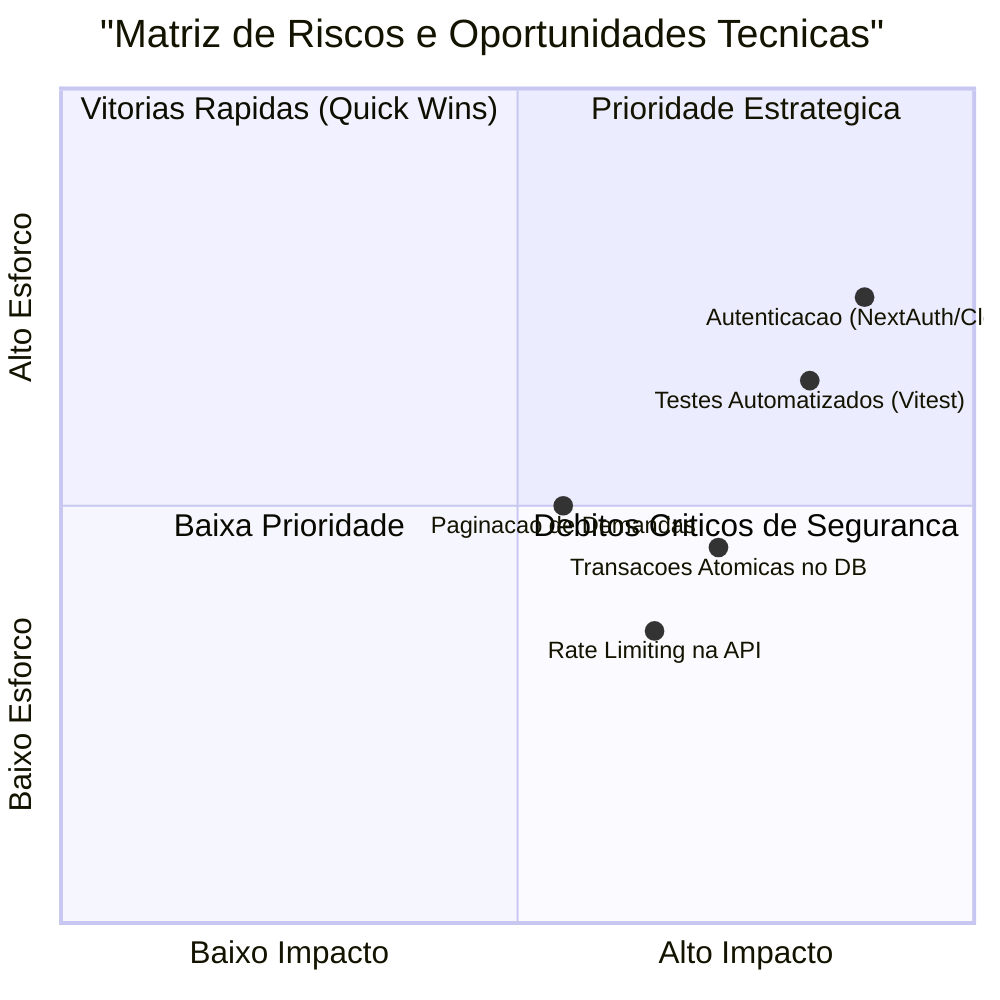

# 📋 Relatório de Análise Técnica Completa: ToDoLabs

> **Documento:** Diagnóstico Arquitetural, Funcional, Segurança e Performance  
> **Sistema:** ToDoLabs — Gestão Ágil de Demandas e Fluxo de Engenharia  
> **Versão:** `0.1.0`  
> **Data da Análise:** Agosto de 2026

---

## 📑 Sumário

1. [Visão Geral e Propósito do Sistema](#1-visão-geral-e-propósito-do-sistema)
2. [Arquitetura de Software e Stack Tecnológica](#2-arquitetura-de-software-e-stack-tecnológica)
3. [Modelagem de Dados e Banco de Dados (Neon PostgreSQL)](#3-modelagem-de-dados-e-banco-de-dados-neon-postgresql)
4. [Mapeamento de Rotas da API e Integração](#4-mapeamento-de-rotas-da-api-e-integração)
5. [Engenharia de Frontend, UX/UI e Acessibilidade (WCAG 2.2)](#5-engenharia-de-frontend-uxui-e-acessibilidade-wcag-22)
6. [Auditoria de Desempenho e Boas Práticas (React 19 & Next.js 16)](#6-auditoria-de-desempenho-e-boas-práticas-react-19--nextjs-16)
7. [Auditoria de Segurança, Privacidade e Resiliência de Infraestrutura](#7-auditoria-de-segurança-privacidade-e-resiliência-de-infraestrutura)
8. [Análise Crítica e Ceticismo Técnico (Riscos e Débitos Técnicos)](#8-análise-crítica-e-ceticismo-técnico-riscos-e-débitos-técnicos)
9. [Roadmap de Evolução Recomendado](#9-roadmap-de-evolução-recomendado)
10. [Fontes e Referências Oficiais Consultadas](#10-fontes-e-referências-oficiais-consultadas)

---

## 1. Visão Geral e Propósito do Sistema

O **ToDoLabs** é uma aplicação web full stack moderna concebida para a **gestão ágil de demandas e fluxo de trabalho de equipes de tecnologia e engenharia de software**. O sistema combina o paradigma tradicional de Kanban com recursos de **gamificação, interatividade física de cartas em leque (_Fan View_) e produtividade acelerada (_Keyboard-First UX_)**.

### Principais Objetivos do Produto:

- **Fluxo de Trabalho Contínuo**: Acompanhar o ciclo de vida completo de cada demanda técnica, desde a fase embrionária (`Ideias / Backlog`) até a entrega (`Concluída`) ou descontinuação (`Cancelada`).
- **Multi-Responsáveis (_Multi-Assignees_)**: Permitir a atribuição de múltiplos desenvolvedores em uma mesma demanda com avatares e papéis claros.
- **Experiência Visual e Física**: Proporcionar um quadro ágil de alta resposta visual (60 FPS), suporte nativo a Dark Mode e identidade corporativa com paleta personalizada (Azul `#004C94` e Laranja `#F7941D`).
- **Auditoria Contínua**: Registrar automaticamente as movimentações, criações e exclusões em uma trilha de atividades persistida.

---

## 2. Arquitetura de Software e Stack Tecnológica

O sistema adota o modelo de **Monólito Modular Serverless em Next.js com App Router**, integrando o frontend reativo e API Route Handlers desacoplados com persistência em nuvem PostgreSQL Serverless.

### Matriz de Tecnologias

| Camada                 | Tecnologia / Pacote                                              | Versão            | Propósito / Responsabilidade                                         |
| :--------------------- | :--------------------------------------------------------------- | :---------------- | :------------------------------------------------------------------- |
| **Framework Base**     | [Next.js](https://nextjs.org/)                                   | `16.3.0`          | App Router, SSR/CSR híbrido, bundling otimizado, API Routes.         |
| **Biblioteca de UI**   | [React](https://react.dev/)                                      | `19.2.8`          | Componentização reativa, `useDeferredValue`, `useSyncExternalStore`. |
| **Estilização**        | [Tailwind CSS](https://tailwindcss.com/)                         | `4.x`             | Design system com CSS Variables, Glassmorphism, Dark Mode nativo.    |
| **Animações & Física** | [Framer Motion](https://motion.dev/)                             | `13.1.0`          | Física do leque de cartas, arrasto livre (drag-and-drop) e modais.   |
| **Ícones**             | [Lucide React](https://lucide.dev/)                              | `1.31.0`          | Iconografia consistente e semântica com suporte a `aria-hidden`.     |
| **Gamificação**        | [Canvas-Confetti](https://www.npmjs.com/package/canvas-confetti) | `1.9.4`           | Feedback comemorativo de dopamina ao concluir tarefas.               |
| **Banco de Dados**     | [Neon Database Serverless](https://neon.tech/)                   | `1.1.0`           | PostgreSQL em nuvem serverless com driver HTTP rápido.               |
| **Utilitários**        | `clsx`, `tailwind-merge`                                         | `2.1.1` / `3.6.0` | Composição de classes CSS dinâmicas e resolução de conflitos.        |

---

## 3. Modelagem de Dados e Banco de Dados (Neon PostgreSQL)

O banco de dados relacional está hospedado no **Neon PostgreSQL**, aproveitando tipos nativos avançados (`UUID`, `JSONB`, `UUID[]`, `TEXT[]`):

### Destaques Técnicos da Modelagem e Consultas:

1. **Otimização de Consultas N+1 via Agregação JSON**:
   - Na rota `GET /api/tasks`, os múltiplos desenvolvedores responsáveis são agregados diretamente na consulta PostgreSQL utilizando `json_agg` e `json_build_object`, ordenados pela posição exata no array `assignee_ids`. Isso elimina o problema de _N+1 queries_, retornando toda a estrutura em uma única viagem de rede (_round-trip_).
2. **Integridade e Desvinculação em Cascata**:
   - Na exclusão de projetos (`DELETE /api/projects/[id]`), as tarefas associadas são removidas previamente.
   - Na exclusão de desenvolvedores (`DELETE /api/users/[id]`), o ID do usuário é desatribuído do campo legado e removido do array de múltiplos responsáveis via `array_remove(assignee_ids, id)`.

---

## 4. Mapeamento de Rotas da API e Integração

As rotas da API estão localizadas em `src/app/api/` e seguem as convenções do Next.js App Router:

| Endpoint             | Método   | Descrição                                            | Validações & Regras                                                   |
| :------------------- | :------- | :--------------------------------------------------- | :-------------------------------------------------------------------- |
| `/api/health`        | `GET`    | Healthcheck ativo da conexão com o Neon DB.          | Executa `SELECT 1` e calcula latência em milissegundos.               |
| `/api/tasks`         | `GET`    | Lista demandas enriquecidas com responsáveis e tags. | Filtro opcional por `?project_id=<uuid>`.                             |
| `/api/tasks`         | `POST`   | Cria nova demanda no quadro.                         | Valida UUID do projeto, sanitiza título, descrição, tags e URL de PR. |
| `/api/tasks/[id]`    | `PUT`    | Atualização parcial/total de uma demanda.            | Validação estrita de UUIDs, enums de status/prioridade e sanitização. |
| `/api/tasks/[id]`    | `DELETE` | Exclusão definitiva de uma demanda.                  | Validação de UUID e retorno de status.                                |
| `/api/projects`      | `GET`    | Lista projetos com contagem agregada de tarefas.     | `COUNT(t.id)` agrupado por projeto.                                   |
| `/api/projects`      | `POST`   | Cria novo projeto.                                   | Limite de caracteres no nome/descrição e cor padrão.                  |
| `/api/projects/[id]` | `PUT`    | Edição dos metadados de um projeto.                  | Atualização com fallback `COALESCE`.                                  |
| `/api/projects/[id]` | `DELETE` | Exclusão do projeto e suas tarefas associadas.       | Limpeza sequencial das tarefas órfãs.                                 |
| `/api/users`         | `GET`    | Lista de desenvolvedores da equipe.                  | Ordenação por Senioridade/Cargo e Nome.                               |
| `/api/users`         | `POST`   | Cadastro de novo desenvolvedor.                      | Validação de e-mail único (HTTP 409) e geração de avatar DiceBear.    |
| `/api/users/[id]`    | `PUT`    | Edição de perfil do desenvolvedor.                   | Checagem de e-mail duplicado em outros registros.                     |
| `/api/users/[id]`    | `DELETE` | Desativação/exclusão de desenvolvedor.               | `array_remove` automático em todas as demandas.                       |
| `/api/activities`    | `GET`    | Log de auditoria (últimos 50 eventos).               | Ordenado por `created_at DESC`.                                       |
| `/api/activities`    | `POST`   | Registro de evento de auditoria.                     | Suporte a metadados em formato `JSONB`.                               |

---

## 5. Engenharia de Frontend, UX/UI e Acessibilidade (WCAG 2.2)

O frontend foi projetado sob o princípio de **"Cockpit de Alta Produtividade para Engenheiros"**:

### 1. Sistema de Visualização Dupla (Fan Mode vs. Grid Mode)

- **Modo Leque (_Fan View_)**: As cartas são empilhadas horizontalmente com margens negativas sobrepostas. Ao passar o mouse (_hover_), a carta ganha elevação no eixo Z e as cartas subsequentes se afastam suavemente em efeito de acordeão elástico (_spring physics_).
- **Modo Grade (_Grid View_)**: Exibição em grade responsiva clássica (`1` a `5` colunas conforme a resolução da tela), ideal para triagem rápida em monitores widescreen.

### 2. Drag and Drop com Resolução Geométrica (`findColumnAtPoint`)

- O sistema utiliza coordenadas globais da tela (`getBoundingClientRect()`) durante o evento `onDrag` e `onDragEnd` do Framer Motion. Isso garante que, mesmo com cartas inclinadas ou transformadas em 3D, a detecção da coluna de destino seja 100% precisa sem travar a interface.

### 3. Produtividade & Keyboard-First UX

- **Paleta de Comandos (`Ctrl+K` ou `/`)**: Permite pesquisar tarefas, projetos e disparar ações rápidas sem tirar as mãos do teclado.
- **Atalhos Globais**:
  - `N`: Nova demanda.
  - `D`: Alternar entre modo Leque e Grade.
  - `M`: Alternar Modo Claro / Noturno.
  - `?`: Abrir modal com mapa de atalhos.
  - `ESC`: Fechar qualquer modal ou gaveta ativa.
- **Cópia Rápida Formatada**: Botão de cópia que gera Markdown estruturado para colar no Slack, Teams ou WhatsApp com título, escopo, tags, prazo e responsáveis.

### 4. Acessibilidade (WCAG 2.2) e PWA

- Todos os botões interativos contêm rótulos descritivos (`aria-label`, `aria-expanded`, `aria-pressed`).
- Foco visível acessível em todos os elementos (`focus-visible:ring-2`).
- Suporte a `@media (prefers-reduced-motion: reduce)`, desativando animações pesadas para usuários com sensibilidade vestibular.
- Suporte completo a PWA com `manifest.js`, cores de tema para iOS/Android e layout responsivo com safe areas (`pb-safe`).

---

## 6. Auditoria de Desempenho e Boas Práticas (React 19 & Next.js 16)

1. **Otimização de Renderização & 60 FPS**:
   - No componente `TaskCard.jsx`, o efeito de iluminação de borda (_spotlight_) atualiza variáveis CSS (`--mouse-x` e `--mouse-y`) diretamente na árvore DOM via `element.style.setProperty`, **sem disparar re-renderizações no estado do React**, garantindo fluidez contínua a 60 FPS.
2. **Code Splitting Dinâmico via `next/dynamic`**:
   - Todos os componentes pesados de modais e painéis laterais (`TaskModal`, `ProjectModal`, `TeamModal`, `CommandPalette`, `ActivityDrawer`, `ShortcutsModal`) são carregados via `dynamic(..., { ssr: false })`, reduzindo o tamanho do bundle JavaScript inicial.
3. **Desacoplamento de Input Concorrente (`useDeferredValue`)**:
   - A busca na interface utiliza `useDeferredValue(searchTerm)` para que a digitação no input permaneça instantânea enquanto a filtragem e ordenação das listas ocorrem em prioridade secundária.
4. **Gerenciamento de Tema Seguro contra Hidratação (`useSyncExternalStore`)**:
   - A sincronização do tema claro/escuro com o `localStorage` e eventos de sistema é feita via `useSyncExternalStore`, eliminando problemas de _hydration mismatch_ do SSR.

---

## 7. Auditoria de Segurança, Privacidade e Resiliência de Infraestrutura

### Pontos Fortes de Segurança Implementados:

1. **Prevenção de SQL Injection**: Todas as chamadas ao banco utilizam _tagged template literals_ parametrizados do driver Neon (`sql\`SELECT ... WHERE id = ${id}\``), impedindo injeção SQL.
2. **Prevenção de XSS via URLs**: Validação e sanitização estrita de URLs de Pull Request através da função `sanitizeSafeURL`, aceitando apenas protocolos seguros (`http:` e `https:`) e bloqueando vetores maliciosos (`javascript:`).
3. **Sanitização de Tamanho de Strings**: Todas as entradas de usuário (`title`, `description`, `name`, `email`, `tags`) são truncadas e limpas antes de persistir no banco.
4. **Resiliência de Rede Corporativa**: Implementação de cliente `resilientFetch` em `src/lib/db.js` com detecção e retentativa automática com recuo exponencial (_exponential backoff_) contra bloqueios transitórios de proxies corporativos e WebFilters (ex: FortiGuard, Zscaler).

---

## 8. Análise Crítica e Ceticismo Técnico (Riscos e Débitos Técnicos)

| Item / Débito Técnico | Impacto | Esforço | Quadrante / Classificação |
| :--- | :---: | :---: | :--- |
| **Autenticação & RBAC (NextAuth/Clerk)** | Alto | Alto | **Prioridade Estratégica** (Governança e proteção pública) |
| **Suíte de Testes Automatizados (Vitest)** | Alto | Médio | **Prioridade Estratégica** (Garantia de não-regressão) |
| **Transações Atômicas no DB (`sql.transaction`)** | Alto | Baixo | **Vitória Rápida (Quick Win)** (Integridade ACID) |
| **Rate Limiting na API** | Médio | Baixo | **Vitória Rápida (Quick Win)** (Proteção anti-spam) |
| **Paginação / Carregamento sob Demanda** | Médio | Médio | **Evolução de Escala** (Performance em quadros com +2k tarefas) |

### 1. Ausência de Camada de Autenticação e RBAC (Risco Médio-Alto)

- **Diagnóstico**: As rotas da API estão públicas. Qualquer usuário na rede pode disparar mutações (`POST`, `PUT`, `DELETE`) em tarefas, projetos e membros da equipe.
- **Impacto**: Aceitável para intranet local/homologação de laboratório, mas crítico para ambiente exposto na internet pública.
- **Recomendação**: Adicionar autenticação unificada (ex: NextAuth / Auth.js ou Clerk) com proteção de rotas via Middleware do Next.js.

### 2. Atomicidade em Operações Multi-tabela (Risco Médio)

- **Diagnóstico**: A rota `DELETE /api/projects/[id]` executa dois comandos `DELETE` separados sequencialmente (primeiro em `tasks`, depois em `projects`). Se a segunda instrução falhar, o estado do banco pode ficar parcialmente modificado.
- **Recomendação**: Utilizar `sql.transaction([...])` do driver Neon para garantir atomicidade ACID estrita.

### 3. Escalabilidade de Carregamento de Tarefas (Risco Baixo-Médio)

- **Diagnóstico**: A tela inicial carrega todas as tarefas do projeto ativo em memória. Para quadros com mais de 2.000 demandas ativas, haverá aumento no consumo de memória no cliente.
- **Recomendação**: Implementar paginação ou carregamento sob demanda para colunas finalizadas (_Concluída_ e _Cancelada_).

### 4. Ausência de Testes Automatizados (Débito Técnico)

- **Diagnóstico**: O repositório possui regras de linting (`eslint` aprovado com 0 erros), mas ainda não possui suíte de testes unitários ou de integração configurada.
- **Recomendação**: Introduzir **Vitest** para testes de utilitários de validação e **Playwright** para testes E2E do fluxo de arrasto do Kanban.

---

## 9. Roadmap de Evolução Recomendado

|    Fase    | Ação Recomendada                                                     | Benefício Técnico                                            | Complexidade |
| :--------: | :------------------------------------------------------------------- | :----------------------------------------------------------- | :----------: |
| **Fase 1** | Implementar `sql.transaction` nas rotas com deleção em lote.         | Consistência de dados ACID no Neon DB.                       |    Baixa     |
| **Fase 2** | Adicionar Rate Limiting nas rotas de API (ex: `@upstash/ratelimit`). | Proteção contra abuso e requisições concorrentes.            |    Baixa     |
| **Fase 3** | Configurar suíte de testes unitários e de integração (`vitest`).     | Garantia contra regressões em lógicas de filtro e tags.      |    Média     |
| **Fase 4** | Integrar autenticação e perfis de acesso (Auth.js / NextAuth).       | Governança corporativa e rastreabilidade por usuário logado. |    Média     |

---

## 10. Fontes e Referências Oficiais Consultadas

1. **Next.js 16 Documentation**: _App Router Architecture, Route Handlers, and Dynamic Imports_ — [https://nextjs.org/docs](https://nextjs.org/docs)
2. **React 19 Official Documentation**: _Concurrent Features, `useDeferredValue`, and `useSyncExternalStore`_ — [https://react.dev/reference/react](https://react.dev/reference/react)
3. **Neon PostgreSQL Serverless Guide**: _Connection Pooling, Edge Fetch Function & Transactions_ — [https://neon.tech/docs](https://neon.tech/docs)
4. **OWASP API Security Top 10**: _Input Validation, SQL Injection Prevention, Broken Object Level Authorization_ — [https://owasp.org/www-project-api-security/](https://owasp.org/www-project-api-security/)
5. **W3C Web Content Accessibility Guidelines (WCAG 2.2)**: _Focus Visible, Contrast, and Reduced Motion_ — [https://www.w3.org/WAI/standards-guidelines/wcag/](https://www.w3.org/WAI/standards-guidelines/wcag/)
